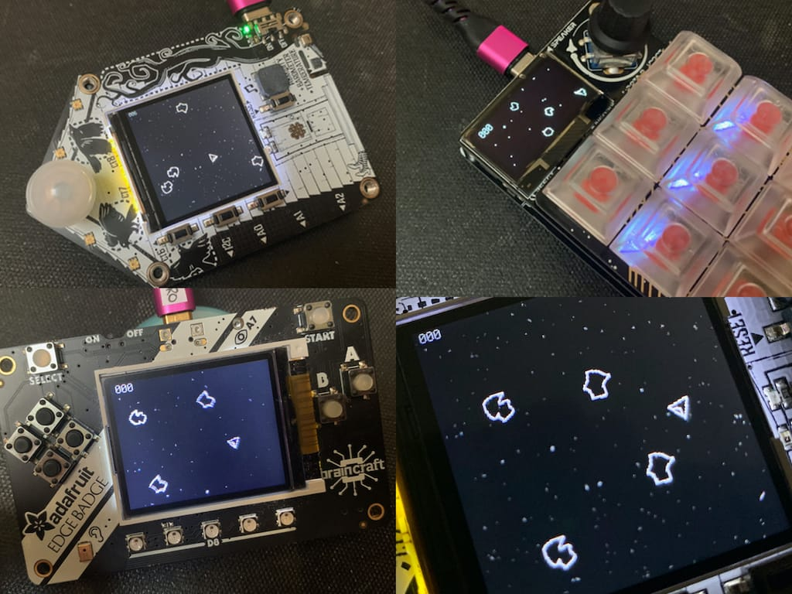

# CircuitPython Staroids

Something like **Asteroids** (but not really), done in CircuitPython.
Works with [FunHouse](https://www.adafruit.com/product/4985), [MacroPad](https://www.adafruit.com/product/5128)
and [Pybadge](https://www.adafruit.com/product/4200).



https://user-images.githubusercontent.com/274093/129097480-3be3b302-d7ba-4690-951a-0822a2933bb3.mp4

(And [@jedgarpark](https://github.com/jedgarpark) modified the [Pybadge version to have sound as seen in this video](https://www.youtube.com/watch?v=sC_fLp5CfTg)!)

## Game rules:
- You control a spaceship in an asteroid field
- Your ship has three controls: Turn Left, Turn Right, and Thrust/Fire
- You get +1 point for every asteroid shot
- You get -3 point every time an asteroid hits your ship
- Game ends when you get bored or the boss comes walking by
- If you hit an asteroid, LEDs flash orange. If your ship is hit, LEDs flash purply.

## Installation

- Install CircuitPython onto your board (requires CircuitPython 7.0.0-alpha.5 or better)
- Install needed CircuitPython libraries
- Copy `staroids_code.py` to your CIRCUITPY drive as `code.py`
- Copy entire `imgs` directory to CIRCUITPY drive

If you have [`circup`](https://github.com/adafruit/circup) installed,
installation can be done entirely via the command-line
using the included `requirements.txt` and a few copy commands. MacOS example below:

```
$ circup install -r ./requirements.txt
$ cp -aX imgs /Volumes/CIRCUITPY
$ cp staroids_code.py /Volumes/CIRCUITPY/code.py

```

## Code techniques demonstrated

If you're interested in how to do stuff in CircuitPython, this code does some things that might be useful. Those include:
- Detecting which board is being used and adjusting I/O & params accordingly
- Sprite sheet animation with `displayio`
- Smooth rotation animation with sprite sheets
- Simple 2D physics engine (velocity & acceleration, okay enough for this game)

## How the sprite sheets were made

(This section is mostly notes for myself)

Given a set of square images named:
- ship0.png - our spaceship coasting
- ship1.png - our spaceship thrusting
- roid0.png - one asteroid shape
- roid1.png - another asteroid shape
- roidexp.png - an exploding asteroid

and you want to create the sprite sheets:
- ship_sheet.bmp  -- two sets (coast + thrust) of 36 10-degree rotations in one palette BMP
- roid0_sheet.bmp -- 120 3-degree rotations in one palette BMP
- staroid1_sheet.bmp -- 120 3-degree rotations in one palette BMP
- roidexp_sheet.bmp -- 8 45-degree rotations in one palette BMP

The entire set of ImageMagick commands to create the sprite sheet of rotations,
as a single shell script is below.

For MacroPad, the sprites had to be re-drawn as 12px square tile instead of 30px.
The were drawn with https://www.pixilart.com/art/staroids-sprites-12px-58e5853d4c2b0ef.
All other sprites were drawn in Pixelmator.

```shell
# ship0 (coasting)
for i in $(seq -w 0 10 359) ; do
echo $i
convert ship0.png -distort SRT $i ship0-r$i.png
done
montage -mode concatenate -tile x1 ship0-r*png  ship0_sheet.png
convert ship0_sheet.png -colors 2 -type palette BMP3:ship0_sheet.bmp

# ship1 (thrusting)
for i in $(seq -w 0 10 359) ; do
echo $i
convert ship1.png -distort SRT $i ship1-r$i.png
done
montage -mode concatenate -tile x1 ship1-r*png  ship1_sheet.png
convert ship1_sheet.png -colors 2 -type palette BMP3:ship1_sheet.bmp

# combine ship0 & ship1 into one sprite sheet
montage -mode concatenate -tile x2 ship0_sheet.bmp ship1_sheet.bmp ship_sheet.png
convert ship_sheet.png -colors 2 -type palette BMP3:ship_sheet.bmp

# roid0
for i in $(seq -w 0 3 359) ; do  
echo $i
convert roid0.png -distort SRT $i roid0-r$i.png 
done
montage -mode concatenate -tile x1 roid0-r*png  roid0_sheet.png
convert roid0_sheet.png -colors 2 -type palette BMP3:roid0_sheet.bmp 

# roid1
for i in $(seq -w 0 3 359) ; do  
echo $i
convert roid1.png -distort SRT $i roid1-r$i.png 
done
montage -mode concatenate -tile x1 roid1-r*png  roid1_sheet.png
convert roid1_sheet.png -colors 2 -type palette BMP3:roid1_sheet.bmp 

# exploding asteroid
for i in $(seq -w 0 45 359) ; do 
echo $i
convert roidexp.png -distort SRT $i roidexp-r$i.png
done
montage -mode concatenate -tile x1 roidexp-r*png  roidexp_sheet.png
convert roidexp_sheet.png -colors 2 -type palette BMP3:roidexp_sheet.bmp

```

